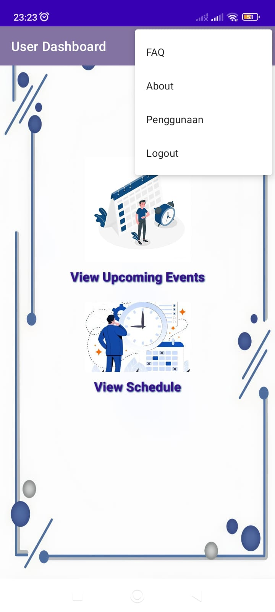

# Event Management App  
*Dibuat oleh: Tri Cahya Armanditha*  

Aplikasi sederhana dan modern untuk mempermudah pengguna mendaftar event, melihat jadwal, serta memudahkan admin dalam mengelola event.  
"Solusi event management yang simple, namun tetap lucu dan mengesankan!"  

---

## 📋 Fitur Aplikasi  

### 1. Splash Screen  
- Tampilan awal aplikasi dengan *2 layout cantik* untuk menyapa pengguna.  
- Berpindah otomatis ke halaman berikutnya setelah 2 detik.  

### 2. Dashboard Login  
- Pilihan: *Login Admin* atau *Login User*.  
- *Belum punya akun?* Pengguna bisa melakukan *Register* terlebih dahulu.  

### 3. Dashboard User  
- *Show Event*:  
  - Melihat daftar event yang tersedia.  
  - Mendaftar langsung ke event yang diinginkan.  
- *Show Schedule*:  
  - Melihat jadwal lengkap event, termasuk hari, jam mulai, dan jam berakhir.  
- *Menu Lainnya:*  
  - *FAQ*: List pertanyaan dan jawaban singkat seputar aplikasi.  
  - *About*: Informasi biodata developer dan partner-nya.  
  - *Penggunaan*: Tutorial yang diarahkan ke link YouTube.  
  - *Logout: **“Jangan pergi dulu 🥹, anda yakin ingin pergi?”*  

### 4. Dashboard Admin  
- *Kelola Event*:  
  - Melihat daftar event dan partisipan.  
  - Menghapus event dan partisipan.  
  - Menambah partisipan dengan konfirmasi nama participant.  
- *Tambah Event*:  
  - Membuat event baru.  
- *Edit Schedule*:  
  - Menambah atau menghapus jadwal sesuai kebutuhan.  

---

## 📸 Tampilan Aplikasi  

### Dashboard Login  

### Dashboard User  

### Dashboard Admin  

---

## 🚀 Teknologi yang Digunakan  
- *Bahasa Pemrograman:* Java  
- *Framework:* Android Studio  
- *Database:* Firebase Realtime Database  
- *Cloud Service:* Firebase Authentication untuk login dan register  

---

## 📚 Panduan Penggunaan  
- Pengguna baru dapat melihat tutorial melalui link berikut: [Tutorial YouTube](https://youtube.com).  
- Admin dapat langsung menggunakan fitur-fitur lengkap di dashboard admin.  

---

## ❤ Tentang Developer  
*Tri Cahya Armanditha*  
"Made with love and a touch of humor to bring a delightful experience for everyone."
